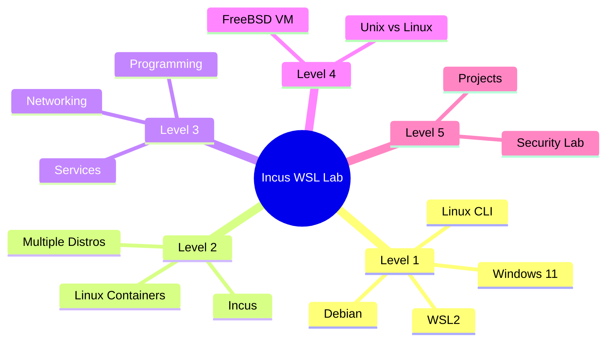

# Incus WSL Learning Laboratory

A beginner-friendly guide to learning Linux and FreeBSD using **Incus inside WSL2 on Windows**.

## Project Purpose

This project teaches students how to use a Windows PC as a personal Linux/Unix learning laboratory:

```
Windows 11
   │
   └── WSL2
        │
        └── Debian
             │
             └── Incus
                  ├── Linux Containers
                  │    ├── Debian
                  │    ├── Ubuntu
                  │    └── Alpine
                  │
                  └── Virtual Machines
                       └── FreeBSD
```

The goal is **not** to turn Linux into Windows. Students learn actual operating-system concepts by working at the command line.

## Target Audience

School, college, and university students with little or no Linux experience.

## Prerequisites

- A Windows 11 PC (64-bit)
- Internet connection
- Administrator access to install software
- Approximately 20 GB of free disk space

## What You Will Learn

1. What WSL2 is and why it is useful
2. How to install Debian in WSL
3. Basic Linux terminal usage
4. How to install and configure Incus
5. How to create and manage Linux containers
6. Networking between containers
7. Running services inside containers
8. Building a programming environment
9. Introduction to FreeBSD virtual machines
10. Basic system administration concepts

## Learning Roadmap



## Estimated Learning Stages

| Stage | Topic | Duration |
|-------|-------|----------|
| 1 | Windows, WSL, Debian basics | 1–2 hours |
| 2 | Linux fundamentals | 2–3 hours |
| 3 | Incus installation and first container | 1–2 hours |
| 4 | Multiple distributions and networking | 2–3 hours |
| 5 | Services and programming lab | 2–3 hours |
| 6 | FreeBSD introduction | 2–4 hours |
| 7 | Student projects | Ongoing |

## Safety Notes

- Commands marked with ⚠️ are destructive. Read the explanation before running.
- Use snapshots before making large changes.
- Containers are isolated — mistakes inside a container do not harm the host.
- FreeBSD VM support depends on `/dev/kvm` being available in WSL2.
- Without `/dev/kvm`, VMs (FreeBSD, Linux, Windows) cannot run in Incus; use Linux containers instead.

## Documentation Structure

| Chapter | File | Topic |
|---------|------|-------|
| 01 | `docs/01-windows-wsl.md` | Windows and WSL |
| 02 | `docs/02-first-steps-debian.md` | First steps in Debian |
| 03 | `docs/03-linux-fundamentals.md` | Linux fundamentals |
| 04 | `docs/04-install-incus.md` | Install Incus |
| 05 | `docs/05-first-container.md` | First Incus container |
| 06 | `docs/06-linux-distributions.md` | Multiple Linux distributions |
| 07 | `docs/07-incus-networking.md` | Incus networking |
| 08 | `docs/08-services.md` | Running services |
| 09 | `docs/09-programming-lab.md` | Programming laboratory |
| 10 | `docs/10-freebsd-lab.md` | FreeBSD laboratory |
| 11 | `docs/11-linux-vs-freebsd.md` | Linux vs FreeBSD |
| 12 | `docs/12-snapshots.md` | Snapshots and recovery |
| 13 | `docs/13-student-projects.md` | Student projects |
| 14 | `docs/14-troubleshooting.md` | Troubleshooting |
| 15 | `docs/15-command-cheatsheet.md` | Command cheat sheet |
| 16 | `docs/16-glossary.md` | Glossary |

## Where Do I Go Next?

After completing this guide, students can explore:

- **Linux system administration** — user management, disk, services
- **Networking** — TCP/IP, DNS, firewall, routing
- **Web development** — Nginx, Apache, PHP, databases
- **Programming** — Python, Go, C, shell scripting
- **DevOps** — CI/CD, automation, configuration management
- **Cybersecurity** — monitoring, hardening, incident response
- **FreeBSD administration** — jails, ZFS, pkg, rc.d
- **Self-hosting** — personal services, reverse proxy, backups
- **Homelab projects** — multi-node setups, clustering, monitoring

## License

This project is licensed under the MIT License. See [LICENSE](LICENSE) for details.

## Tested With

> **Tested with:**
> - Windows 11 (22H2+)
> - WSL2
> - Debian 13
> - Incus 6.x
> - `/dev/kvm` available (for VMs)

Commands may differ on other versions. Always check the official documentation for your specific version.
